# Graph RAG Indexing Pipeline — Google Cloud

## Architecture Overview

```mermaid
flowchart LR
    BQ["BigQuery\n(Source Transcripts)"] --> S1["1. Load Documents"]
    S1 --> S2["2. Chunk Text Units"]
    S2 --> S3["3. Finalize Documents"]
    S3 --> S4["4. Extract Graph\n(Gemini)"]
    S4 --> S5["5. Finalize Graph"]
    S5 --> S7["7. Leiden Clustering"]
    S7 --> S8["8. Finalize Text Units"]
    S8 --> S9["9. Community Reports\n(Gemini)"]
    S9 --> S10["10. Embeddings\n(Vertex AI)"]
    S10 --> Spanner["Spanner Graph\n(Final Store)"]
```




**Google Cloud services used:**

- **BigQuery** — source data + intermediate tables (durable between steps, allows re-runs)
- **Vertex AI Gemini 3.0 Flash** — entity/relationship extraction, description summarization, community reports, use batch API to paralelize 
- **Vertex AI text-embedding-005** — embeddings for text units, entities, and community reports
- **Spanner Graph** — final graph + vector store (property graph with ANN vector indexes)

## Project Structure

```
end-to-end-graphrag/
  main.py                          # CLI: run full pipeline or individual steps
  config.yaml                      # All tunables (project, dataset, models, chunking params)
  graphrag/
    __init__.py
    config.py                      # Pydantic Settings from config.yaml + env vars
    models.py                      # Dataclasses: Document, TextUnit, Entity, Relationship, Community
    pipeline/
      __init__.py
      load_documents.py            # Step 1
      create_text_units.py         # Step 2
      finalize_documents.py        # Step 3
      extract_graph.py             # Step 4
      finalize_graph.py            # Step 5
      extract_covariates.py        # Step 6 (optional, disabled by default)
      create_communities.py        # Step 7
      finalize_text_units.py       # Step 8
      community_reports.py         # Step 9
      generate_embeddings.py       # Step 10
    llm/
      __init__.py
      client.py                    # Async Gemini wrapper: batching, retries, rate limiting
      prompts.py                   # All prompt templates (extraction, summarization, reports)
    chunking/
      __init__.py
      chunker.py                   # Token-based overlapping chunker
    storage/
      __init__.py
      bigquery.py                  # Read/write intermediate BigQuery tables
      spanner.py                   # Spanner Graph DDL + bulk write
```

## Configuration (`config.yaml`)

```yaml
gcp:
  project_id: "my-project"
  location: "us-central1"

bigquery:
  source_dataset: "calls"
  source_table: "transcripts"          # columns: id STRING, text STRING
  intermediate_dataset: "graphrag"     # created automatically

spanner:
  instance_id: "graphrag-instance"
  database_id: "graphrag-db"

llm:
  model: "gemini-2.0-flash"
  temperature: 0.0
  max_output_tokens: 4096
  max_concurrent_requests: 50         # rate limiting
  max_retries: 3
  gleaning_rounds: 1                  # extra extraction passes

embedding:
  model: "text-embedding-005"
  dimensions: 768
  batch_size: 250                     # Vertex AI batch limit

chunking:
  method: "tokens"                    # "tokens" or "sentences"
  chunk_size: 300                     # tokens per chunk
  chunk_overlap: 100                  # overlap between chunks

community:
  max_levels: 5                       # Leiden hierarchy depth
  resolution: 1.0                     # Leiden resolution parameter

pipeline:
  batch_size: 500                     # rows per processing batch
  skip_covariates: true               # step 6 disabled by default
```

## Data Models (`graphrag/models.py`)

Core dataclasses used throughout the pipeline:

```python
@dataclass
class Document:
    id: str               # SHA-256 hash of raw_content
    title: str
    raw_content: str
    text_unit_ids: list[str] = field(default_factory=list)

@dataclass
class TextUnit:
    id: str               # UUID
    document_id: str
    text: str
    n_tokens: int
    entity_ids: list[str] = field(default_factory=list)
    relationship_ids: list[str] = field(default_factory=list)

@dataclass
class Entity:
    id: str               # UUID
    title: str            # canonical name (uppercased)
    type: str             # PERSON, ORG, CONCEPT, etc.
    description: str      # LLM-summarized
    human_readable_id: int
    degree: int
    text_unit_ids: list[str]
    community_ids: list[str] = field(default_factory=list)

@dataclass
class Relationship:
    id: str
    source_entity_id: str
    target_entity_id: str
    description: str
    weight: float
    human_readable_id: int
    text_unit_ids: list[str]

@dataclass
class Community:
    id: str
    level: int
    title: str | None
    summary: str | None
    full_content: str | None
    rating: float | None
    entity_ids: list[str]
    relationship_ids: list[str]
    text_unit_ids: list[str]
    parent_community_id: str | None
    child_community_ids: list[str]
```

## Step-by-Step Implementation Details

### Step 1: `load_documents.py`

- Query BigQuery `calls.transcripts` table
- For each row, compute `document_id = sha256(text)`
- Deduplicate by hash
- Write to BigQuery `graphrag.documents` table
- Process in streaming batches of `pipeline.batch_size` to handle 100K+ rows

### Step 2: `create_text_units.py`

- Read documents from `graphrag.documents` in batches
- For each document, split text into overlapping chunks using `tiktoken` (cl100k_base as a reasonable tokenizer)
- Each chunk gets a UUID and a back-reference `document_id`
- Optionally prepend metadata: `"Document: {title}\n\n{chunk_text}"`
- Write to BigQuery `graphrag.text_units`

### Step 3: `finalize_documents.py`

- Query `graphrag.text_units` grouped by `document_id`
- Update `graphrag.documents` with the array of `text_unit_ids`

### Step 4: `extract_graph.py` (LLM-heavy)

This is the most complex and expensive step.

- Read text units in batches
- For each text unit, call Gemini with the **entity/relationship extraction prompt** (structured output via JSON mode)
- Optionally perform **gleaning**: re-prompt with "did you miss any entities?" for `gleaning_rounds` iterations
- Use `asyncio.Semaphore(max_concurrent_requests)` for rate limiting
- **Merge phase**: group extracted entities by `(title_upper, type)`, collect all descriptions and source text_unit_ids
- **Summarize phase**: for entities/relationships with multiple descriptions, call Gemini to produce a single merged description
- Write to BigQuery `graphrag.entities_raw` and `graphrag.relationships_raw`

Prompt template (entity extraction) will follow Microsoft GraphRAG's approach:

```
Given the following text, identify all entities and relationships.
For each entity, extract: name, type, description.
For each relationship, extract: source, target, description, weight (0-1).
Return as JSON: {"entities": [...], "relationships": [...]}
```

### Step 5: `finalize_graph.py`

- Read entities and relationships from BigQuery
- Build a NetworkX graph
- Compute `degree` for each entity (number of edges)
- Assign sequential `human_readable_id` (sorted by degree descending)
- Write finalized tables: `graphrag.entities`, `graphrag.relationships`
- Optionally export `.graphml` to Cloud Storage

### Step 6: `extract_covariates.py`

- Disabled by default (`skip_covariates: true`)
- Same pattern as step 4 but with a claims extraction prompt

### Step 7: `create_communities.py`

- Read `graphrag.entities` and `graphrag.relationships`
- Build an igraph graph (better Leiden support than NetworkX)
- Run **Hierarchical Leiden** via `graspologic.partition.hierarchical_leiden()`
- For each level, record community assignments
- Compute community membership: `entity_ids`, `relationship_ids` (edges where both endpoints are in the community), `text_unit_ids` (union of members' text_unit_ids)
- Write to BigQuery `graphrag.communities`

### Step 8: `finalize_text_units.py`

- Read entities and relationships, invert the `text_unit_ids` lists
- For each text unit, collect which entities and relationships reference it
- Update `graphrag.text_units` with `entity_ids`, `relationship_ids`

### Step 9: `community_reports.py` (LLM-heavy)

- Process communities **bottom-up** (lowest level first)
- For each community, assemble context:
  - Entity names, types, descriptions, degree
  - Relationship descriptions
  - For higher-level communities: substitute sub-community report summaries
  - Trim to token budget (~maximum context for Gemini)
- Call Gemini with the **community report prompt** (structured JSON output):

```json
{
  "title": "...",
  "summary": "...",
  "rating": 7.5,
  "rating_explanation": "...",
  "findings": [
    {"summary": "...", "explanation": "..."},
    ...
  ]
}
```

- Write to BigQuery `graphrag.community_reports`

### Step 10: `generate_embeddings.py`

- Three embedding jobs:
  1. `text_unit.text` -> vector
  2. `entity.title + ": " + entity.description` -> vector
  3. `community_report.full_content` -> vector
- Use Vertex AI `text-embedding-005` in batches of 250 (API limit)
- Rate-limit with asyncio semaphore
- Write vectors back to BigQuery intermediate tables
- **Final sync to Spanner Graph**: bulk-write all tables (documents, text_units, entities, relationships, communities) including embedding vectors to Spanner

### Spanner Graph Schema

Spanner Graph overlays a property graph on regular relational tables:

```sql
-- Node tables
CREATE TABLE Documents ( ... ) PRIMARY KEY (id);
CREATE TABLE TextUnits ( ... ) PRIMARY KEY (id);
CREATE TABLE Entities  ( ... ) PRIMARY KEY (id);
CREATE TABLE Communities ( ... ) PRIMARY KEY (id);

-- Edge table
CREATE TABLE Relationships (
  id STRING(36) NOT NULL,
  source_entity_id STRING(36) NOT NULL,
  target_entity_id STRING(36) NOT NULL,
  ...
) PRIMARY KEY (id);

-- Vector index on Entities
CREATE VECTOR INDEX EntitiesEmbeddingIdx
  ON Entities(description_embedding)
  OPTIONS (distance_type = 'COSINE', tree_depth = 3, num_leaves = 1000);

-- Property Graph overlay
CREATE OR REPLACE PROPERTY GRAPH KnowledgeGraph
  NODE TABLES (Entities, Documents, TextUnits, Communities)
  EDGE TABLES (
    Relationships
      SOURCE KEY (source_entity_id) REFERENCES Entities(id)
      DESTINATION KEY (target_entity_id) REFERENCES Entities(id)
  );
```

## CLI Interface (`main.py`)

```python
python main.py --config config.yaml                     # run all steps
python main.py --config config.yaml --step 4            # run step 4 only
python main.py --config config.yaml --from-step 7       # resume from step 7
```

## Dependencies (`pyproject.toml`)

- `google-cloud-bigquery` — BigQuery I/O
- `google-cloud-spanner` — Spanner Graph writes
- `google-cloud-aiplatform` — Vertex AI (Gemini + embeddings)
- `graspologic` — Hierarchical Leiden clustering
- `igraph` — graph construction for Leiden
- `networkx` — graph utilities, GraphML export
- `tiktoken` — token counting for chunking
- `pydantic` / `pydantic-settings` — config and data validation
- `pyyaml` — config file parsing
- `tenacity` — retry logic for API calls

## Scale Considerations (100K+ transcripts)

- **Batch processing**: every step reads/writes BigQuery in configurable batches (`pipeline.batch_size`)
- **Async LLM calls**: steps 4, 9 use `asyncio` with a semaphore for controlled parallelism (`max_concurrent_requests: 50`)
- **Resumability**: each step is idempotent — it checks if the output table exists and can be re-run; `--from-step N` skips completed steps
- **Cost estimate**: ~100K transcripts x ~2K tokens avg = 200M input tokens for extraction alone. At Gemini 2.0 Flash pricing this is roughly $15-30 for extraction + $5-10 for summarization + $5-10 for community reports
- **Entity merge**: in-memory merge is feasible since unique entity count is typically 10-100x smaller than raw extractions; if needed, can partition by entity type
